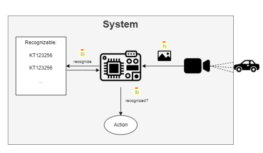
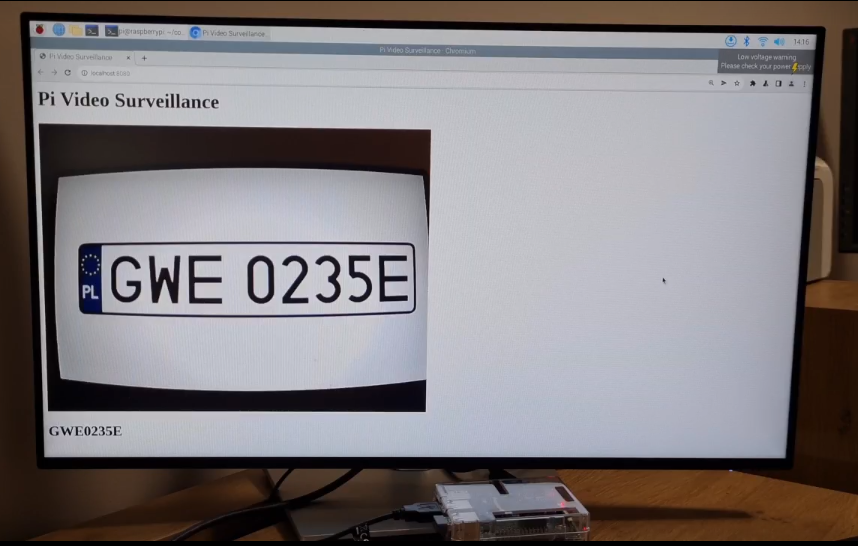

# Licence palates detector
Project performed as a part of Embedded Systems subject. Developed with purpose of recognition licence plates with usage of Raspberry pi 3B. 

### Technologies
Project is created with:

* Python 3.8
* Raspberry pi 3B
* OpenCV
* Flask
* Tesseract

### Workflow schema 

### Set Up

Program consist of few runnable files depending on purpose we want to achieve
* main - hosts webapp that visualize camera view and predictions. Run in main dir by `python main.py`
* detection_contours - uses contours detection as engine. Depending on chosen mode. If debug = True app shows camera Run in main dir by `python -m src.experiments.detection_contours`
  view with rectangles that contains detected object also prints predictions. If debug = False, only prints predictions
* detection_text_fields - uses text fields detection as engine. As above, works in to modes. Run in main dir by `python -m src.experiments.detection_text_fields`
* comparison - compare two detection engines using static pictures, measure time of detection, visualise results. Run in main dir by `python -m src.experiments.comparison`

### Visuals

